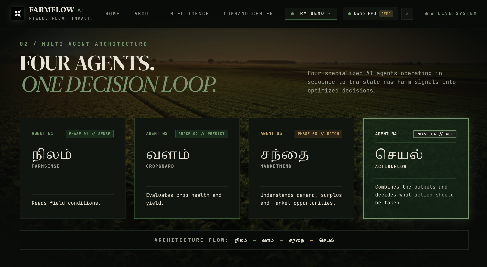
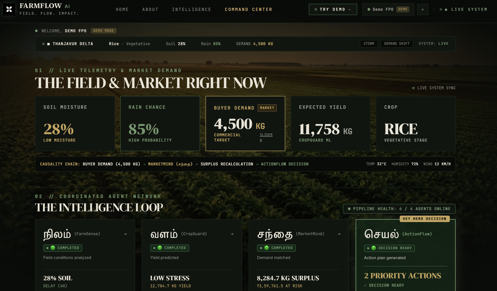
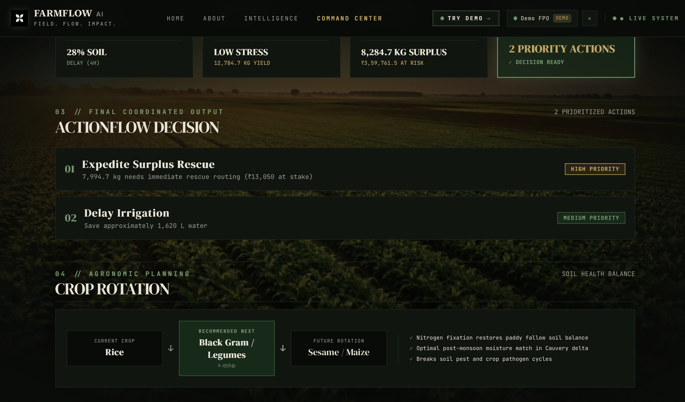

# FarmFlow AI

### Multi-Agent Precision Agriculture System

FarmFlow AI is a multi-agent precision agriculture system designed to connect field sensing, crop prediction, market matching, and action planning into a single decision-making pipeline.

It combines a React-based interface with a Python backend where specialized agents work together to transform farm data into actionable insights.

---

## The Agent Pipeline

```text
SENSE  →  PREDICT  →  MATCH  →  ACT
   ↓         ↓          ↓         ↓
FarmSense  CropGuard  MarketMind  ActionFlow
```

### FarmSense — SENSE

Analyzes field and environmental conditions such as temperature, humidity, soil moisture, rainfall probability, wind speed, crop, and crop stage to generate irrigation-related insights.

### CropGuard — PREDICT

Uses farm conditions and FarmSense outputs to estimate crop health and expected yield.

### MarketMind — MATCH

Matches predicted harvest quantities with available market and destination demand.

### ActionFlow — ACT

Combines the outputs of the preceding agents and generates a prioritized action plan.

---

## Architecture

```text
                    FarmFlow AI
                         │
             ┌───────────┴───────────┐
             │                       │
       React + Vite              FastAPI
        Frontend                  Backend
             │                       │
             │              ┌────────┴────────┐
             │              │                 │
             │          FarmSense        CropGuard
             │              │                 │
             │              └────────┬────────┘
             │                       │
             │                  MarketMind
             │                       │
             │                  ActionFlow
             │                       │
             └─────────────── API ───┘
```
---

## Preview

### Multi-Agent Architecture

<p align="center">
  
</p>

### Command Center

<p align="center">
  
</p>

### ActionFlow Decision

<p align="center">
  
</p>

---


## Features

- Multi-agent agricultural decision pipeline
- Farm telemetry analysis
- Crop health and yield prediction
- Harvest-to-market matching
- Automated action planning
- Role-based authentication
- Interactive API documentation
- React-based dashboard interface
- Modular agent architecture

---

## Tech Stack

### Frontend

- React
- Vite
- JavaScript
- CSS

### Backend

- Python
- FastAPI
- Pydantic
- Uvicorn

### AI & System Design

- Multi-agent architecture
- Machine learning-based prediction
- Data-driven decision pipeline

---

## API

The backend exposes endpoints for individual agents as well as the complete pipeline.

```text
POST /api/farmsense
POST /api/cropguard
POST /api/marketmind
POST /api/actionflow

GET  /health
GET  /docs
```

FastAPI also provides an interactive Swagger UI for exploring and testing the API locally.

---

## Running Locally

### 1. Clone the repository

```bash
git clone https://github.com/shrutikaagokul/farmflow-ai.git
cd farmflow-ai
```

### 2. Install frontend dependencies

```bash
npm install
```

### 3. Install Python dependencies

```bash
pip install -r requirements.txt
```

### 4. Start the backend

```bash
python -m uvicorn server:app --port 8000 --reload
```

The backend API will be available at:

```text
http://localhost:8000
```

Interactive API documentation:

```text
http://localhost:8000/docs
```

### 5. Start the frontend

In a separate terminal:

```bash
npm run dev
```

Then open the local URL provided by Vite.

---

## Project Structure

```text
farmflow-ai/
│
├── agents/
│   ├── farmsense/
│   ├── cropguard/
│   ├── marketmind/
│   └── actionflow/
│
├── auth/
│
├── data/
│
├── public/
│
├── src/
│   ├── assets/
│   ├── components/
│   ├── context/
│   ├── data/
│   ├── pages/
│   └── utils/
│
├── server.py
├── requirements.txt
├── package.json
├── package-lock.json
└── vite.config.js
```

---

## Project Status

FarmFlow AI is a working prototype exploring how multiple specialized agents can be connected into a unified agricultural decision-support system.

The project focuses on combining field intelligence, predictive analysis, market awareness, and action planning into one connected workflow.

---

## Built With

React · Vite · Python · FastAPI · Machine Learning · Multi-Agent Systems
